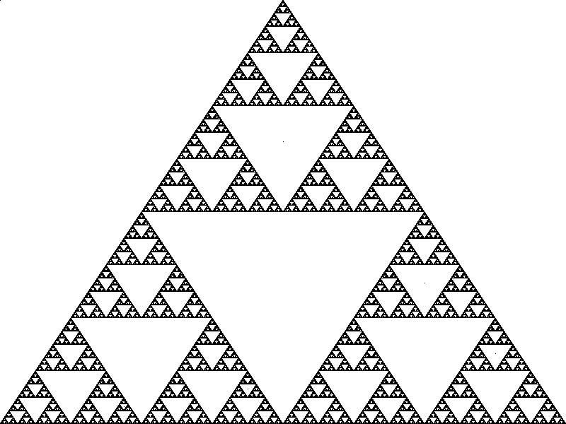

# triangle
> sierpinski triangle image generator


## Table of contents
* [General info](#general-info)
* [Screenshots](#screenshots)
* [Technologies](#technologies)
* [Setup](#setup)
* [Status](#status)
* [Contact](#contact)

## General info
In the search to do something expressive and thorough in rust I came across this [video](https://www.youtube.com/watch?v=T2Hwu-XiVkA) and thought it would be fun to follow along.

## Screenshots


## Technologies
* rust with dependencies on image and rand

## Setup
```
rust build --release
./target/release/triangle
```

## Status
Project is: _finished_

## Contact
Input and tinkered-around-with by [@InterruptSpeed](https://github.com/InterruptSpeed/).
